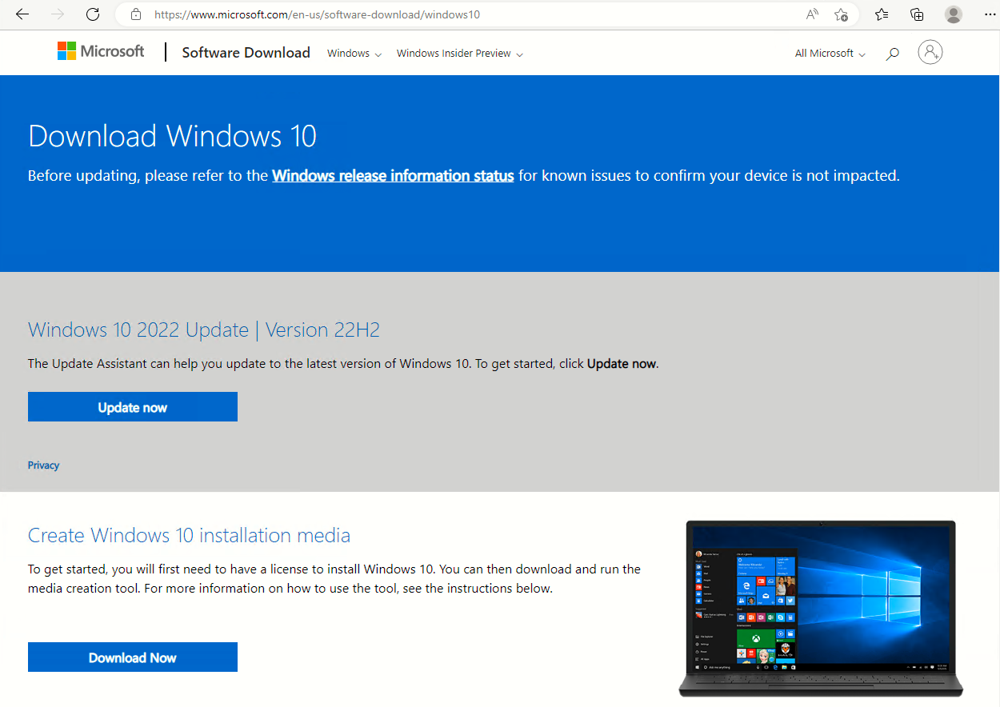

# Instalando Windows 10

Esta es mi experiencia instalando Windows 10 en Virtual Box.


## Paso 1

Descargamos el fichero ISO de la herramienta

```  MediaCreationTool22H2  ```

Descargada de este enlace:  [pincha aquí](https://www.microsoft.com/es-es/software-download/windows10)




## Paso 2

Al iniciar el programa `MediaCreationTool22H2`

Aparece el siguiente asistente:


## Paso 3

El siguiente paso es aceptar el acuerdo de licencia:


## Paso 4

Después, el instalador nos dará las siguientes opciones, de las cuales elegimos `Crear medios de instalación`:


## Paso 5

Configuramos los parámetros del Sistema Operativo:


## Paso 6

Elegimos el medio para instalar el Sistema Operativo, en nuestro caso una `Imagen ISO`:


## Paso 7

Por último, elegimos la ruta en la que la `Imagen ISO` se va a guardar:


Esperamos a que se descargue:


## Paso 8

Por último, ya tenemos la `Imagen ISO` guardada:

Hasta aquí, la creación del `Fichero ISO`.
Ya podemos montarla en virtualBox para crear nuestra maquina virtual de `Windows 10`.


# Instalando Windows 10 en Virtual Box

Abrimos Virtual Box, vamos a Máquina > Nueva (Ctrl+N), y montamos la `imagen ISO` de Windows 10 que hemos descargado previamente.


(...)


# Instalando Windows Server 2019

## Paso 1

Descargamos el fichero ISO de `Windows Server 2019`, de este enlace:  [pincha aquí](https://www.microsoft.com/en-us/evalcenter/download-windows-server-2019)


Elegimos la imágen `ISO English (United States) 64-bit edition`.


(...)


# Instalando Linux CentOS

## Paso 1

Descargamos el fichero ISO de `Linux CentOS`, desde su web oficial, este enlace: [pincha aquí](https://www.centos.org/download/)


Elegimos la arquitectura X86_64.


(...)

